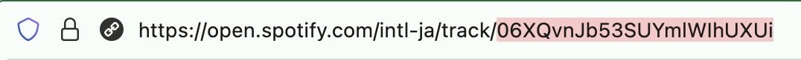
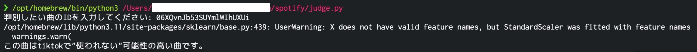

# K近傍法を用いた楽曲分類

<p align="left">
    <!-- python icon -->
    
    <!-- code size -->
    
</p>

### 動作環境
- Python 3.11.3

### 事前準備
pip3にて以下のライブラリを事前にインストールする。
- spotipy ... Spotifyが提供しているAPI
- pandas ... データ処理を行うためのライブラリ
- joblib ... 大きなデータを効率的に保存し、取り扱うためのライブラリ
- scikit-learn ... 機械学習やデータマイニングのためのライブラリ
- matplotlib ... グラフやチャート作成のためのデータ可視化ライブラリ
- tabulate ... テキストベースのテーブルを簡単に表示するためのライブラリ

```sh
pip3 install spotipy pandas joblib scikit-learn matplotlib tabulate
```

[Spotify for Developer](https://developer.spotify.com)にて`client_id`と`client_secret`を取得する。

### 取得するデータ
Audio Featuresにて提供されているデータから、ある程度分類に役立ちそうなものを取得する。

| データ名 | 詳細 |
| :-: | - |
| acousticness | 曲の音響的な特徴を表す指標。0.0（音響的でない）から1.0（音響的）の範囲で表される。 |
| danceability | 曲がダンスに適しているかどうかを表す指標。0.0（ダンスに適さない）から1.0（ダンスに適している）の範囲で表される。 |
| energy | 曲のエネルギーの強さを表す指標。0.0（エネルギーが低い）から1.0（エネルギーが高い）の範囲で表される。 |
| instrumentalness | 曲がインストゥルメンタルかどうかを表す指標。0.0（ボーカル曲）から1.0（インストゥルメンタル曲）の範囲で表される。 |
| key | 曲のキーを表す数値。0から11までの整数で表される。 |
| liveness | 曲の演奏がライブ録音かどうかを表す指標。0.0（スタジオ録音）から1.0（ライブ録音）の範囲で表される。 |
| loudness | 曲の音量を表す指標。-60から0の範囲で表される。 |
| mode | 曲のモード（メジャーかマイナーか）を表す数値。0（マイナー）または1（メジャー）で表される。 |
| speechiness | 曲の音声の存在を表す指標。0.0（音声が少ない）から1.0（音声が多い）の範囲で表される。 |
| tempo | 曲のテンポ（BPM）を表す数値。 |
| time_signature | 曲の拍子記号を表す整数。 |
| duration_ms | 曲の再生時間をミリ秒単位で表す整数値。 |
| valence | 曲のポジティブさまたはネガティブさを表す指標。0.0（ネガティブ）から1.0（ポジティブ）の範囲で表される。 |

## 使用方法
1. 最新のデータセットを作る場合は`tiktok_to_csv.py`と`not_tiktok_tto_csv.py`を実行しデータセットを構築後、`knn.py`を実行し学習済モデルを`model.joblib`に保存。
2. [Spotify.com](https://open.spotify.com/intl-ja)内で曲を検索。
3. 調べたい曲のURLの最後のスラッシュ以降のID（英数字の羅列）をコピー。

4. `judge.py`を実行しIDを入力。Tiktokで使われる可能性の高い曲かそうでないかの判別結果が出力される。


## APIを用いたリクエストについて
SpotifyのAPIでは、一度のリクエストで取得できる検索結果の上限は通常50件である。そのため、仮に1000曲の情報を取得するためには、複数のリクエストを行い、結果を結合する必要がある。
ただし、SpotifyのAPIのには使用制限があり、短時間に多くのWeb APIリクエストを行った場合、Spotifyから429エラーレスポンスを受け取ることがある。

具体的には、Spotifyに対して30秒間に行った呼び出しの数に基づいて計算される。

APIの使用制限は、違反するとアカウントの一時的な停止や制限が課される可能性がある。したがって、制限を超えないように注意し、利用規約に従う必要がある。

### Reference
- [Spotify API Documentation](https://developer.spotify.com/documentation/web-api/tutorials/getting-started)
- [APIの使用制限について - Rate Limits](https://developer.spotify.com/documentation/web-api/concepts/rate-limits)
